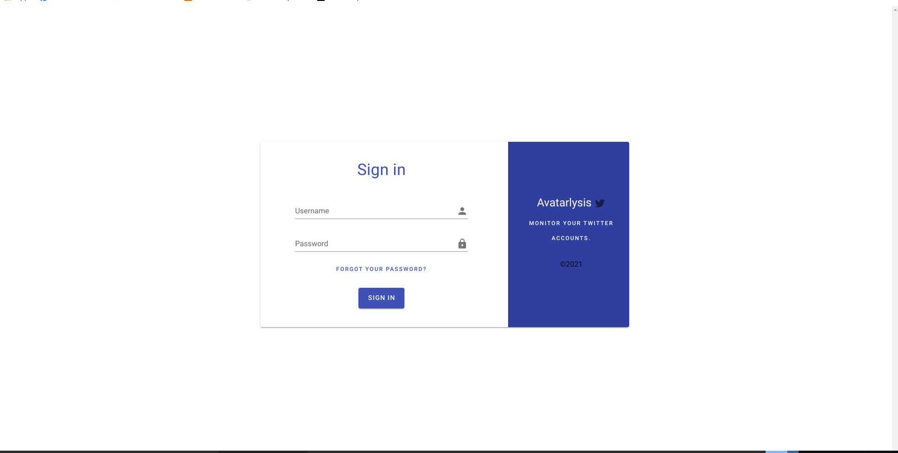
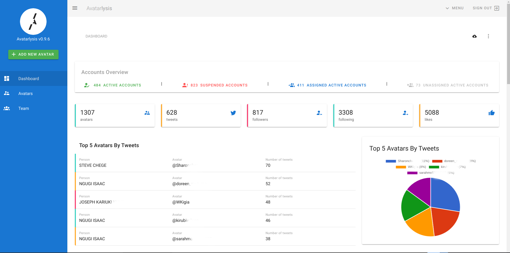
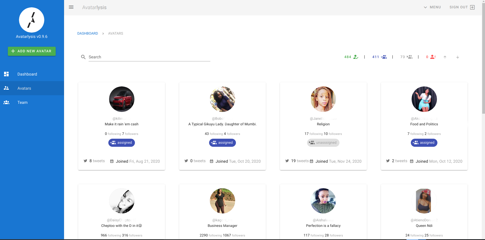

RUNNING BACKEND
===============
There are two binaries one for admin and one for the app. The admin is used to set up the generating public and private ssh keys for use in generating jwt tokens.

STEP 1
======
Ensure you have docker and docker-compose installed.
Make sure that no program is running on port 5432
      sudo service postgresql stop
Also if you had previously run this we need to stop all running containers.So first run this to do some house cleaning for you.
      
      make clean

Then there is a docker-compose file for our postgresql container image. 
Run it like so on your terminal:
        make db-up
        
To stop it run:

        make db-down

STEP 2
======
Run the admin binary with the following command

        make keygen

STEP 3
======
Run the server binary (this should never run before the db)

        make server
        
To stop the serve just hit ctrl+c.

STEP 5
=======
Run the frontend.To run it you will use docker to load the frontend image like so 

        make web-up
 
To stop the frontend server run:

        make web-down

# WEB UI
When everything runs successfully you should be able to have a beautiful and simple UI like the one shown below.   

## TODO
- Add circuit breaker logic for when we hit the twitter api limits.
- Add metrics exporters e.g. prometheous.
- Refactor code to enhance readability.
- Add CI/CD (critical)